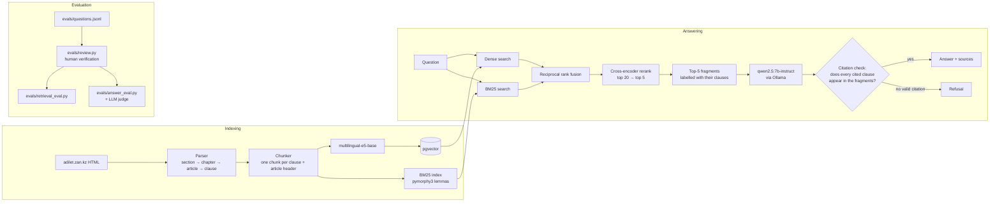

# kz-labor-rag

Question answering over the Labour Code of the Republic of Kazakhstan, with
answers that cite the exact article and clause, an honest "the Code does not
answer this", and an evaluation that anyone can rerun.

The interesting part of the project is not the chatbot but the measurement:
the evaluation harness was built before the RAG pipeline, every metric is
computed by a script in this repository, and the numbers below are pasted into
this file by `eval.py`, not typed by hand.

## Problem

People ask labour-law questions in plain language — "they want to fire me while
I'm on sick leave, is that legal?" — while the answer sits in one clause of a
223-article code written in legal Russian. A useful answer has to:

- find the right **clause**, not just the right article (article 52 lists more
  than twenty grounds for dismissal);
- cite it (`ст. 54 п. 1`) so the reader can check;
- say "В Трудовом кодексе ответа на это не нашлось" when the question belongs
  to another law (taxes, pensions, migration) instead of improvising.

## Architecture



The service is a thin FastAPI wrapper (`src/kz_labor_rag/api.py`) over the
library; the evaluation scripts import the same library, so the API and the
measurements cannot drift apart. After hybrid fusion a cross-encoder
(`BAAI/bge-reranker-v2-m3`) re-orders the top 20 candidates; this combination
was picked from the retrieval table below, not before it existed.

## How to run

Requirements: Docker with about 10 GB of memory and 20 GB of disk (the
generation model and the reranker are loaded at the same time).

```bash
cp .env.example .env
```

```bash
docker compose up
```

The first start takes a while: the API container downloads the Code from
adilet.zan.kz and verifies its checksum, Ollama pulls `qwen2.5:7b-instruct`
(4.7 GB), and the index is built on CPU. Everything is cached in volumes, so
later starts take seconds. Progress is in `docker compose logs -f api`.

```bash
curl http://localhost:8000/health
```

```bash
curl -N 'http://localhost:8000/ask/stream?q=Меня+хотят+уволить+на+больничном,+так+можно?'
```

| Endpoint | What it returns |
|---|---|
| `GET /search?q=` | top-5 fragments with raw scores and clause labels |
| `GET /ask?q=` | answer, verified citations, `refused` / `withheld` flags, fragments |
| `GET /ask/stream?q=` | the same as server-sent events: `hits`, `token`…, `done` |
| `GET /context?q=` | the exact context the model sees |

In `/ask/stream` citations can only be checked once the answer is complete, so
the authoritative text is `done.answer`: if the model cited nothing it was
shown, `withheld` is `true` and the answer is replaced by the refusal.

**Faster generation on a Mac.** Docker on macOS has no GPU access, so Ollama in
a container runs on CPU. A native Ollama (`brew install ollama`) uses Metal;
point the service at it with `KZRAG_OLLAMA_URL=http://host.docker.internal:11434`.

## Results

All numbers below are produced by `python eval.py`. The evaluation set is still
being verified by hand, and metrics are computed **on verified questions only**,
so the sample sizes are small — treat differences between rows as anecdotes
until the verified count grows. Latency, chunk counts and context sizes do not
depend on the sample size and are meaningful now.

### Test set

<!-- BEGIN dataset_summary -->
86 questions in `evals/questions.jsonl`: 76 answerable, 10 unanswerable; 15 real user questions, 71 written for this set. **82 verified** — metrics are computed on these only: 3 checked by hand, 79 by a model-assisted review pass. Random spot check of the model-reviewed questions by hand: 13 of 15 confirmed.

| type | questions | verified |
|---|---|---|
| fact | 12 | 12 |
| number | 18 | 17 |
| condition | 23 | 22 |
| multi | 23 | 21 |
| unanswerable | 10 | 10 |
<!-- END dataset_summary -->

### Retrieval: chunking × retrieval method

Script: [`evals/retrieval_eval.py`](evals/retrieval_eval.py). Full per-question
output: `evals/results/retrieval/*.json`.

<!-- BEGIN retrieval_table -->
Verified questions with a retrieval gold: n = 72 (real 13, synthetic 59). Latency is measured on CPU after warm-up. Intervals: bootstrap over questions (10,000 resamples); Δ: paired bootstrap against `fixed512/e5-base/dense`, `*` — the interval excludes zero.

| chunking | embeddings | method | chunks | context tokens@5 | recall@5 [95% CI] | MRR [95% CI] | Δ recall@5 vs baseline | article_recall@5 | latency p50, ms | latency p95, ms | dense p50 | bm25 p50 | fusion p50 | rerank p50 |
|---|---|---|---|---|---|---|---|---|---|---|---|---|---|---|
| fixed512 | e5-base | dense | 143 | 2537 | 0.649 [0.54, 0.75] | 0.479 [0.38, 0.58] | baseline | 0.736 | 56.2 | 64.7 | 56.2 | — | — | — |
| fixed512 | e5-base | bm25-lemma | 143 | 2536 | 0.465 [0.35, 0.58] | 0.303 [0.22, 0.39] | -0.184 [-0.32, -0.05] * | 0.514 | 0.3 | 0.5 | — | 0.3 | — | — |
| fixed512 | e5-base | hybrid | 143 | 2537 | 0.688 [0.58, 0.78] | 0.494 [0.40, 0.59] | +0.038 [-0.09, +0.16] | 0.743 | 53.1 | 76.1 | 52.6 | 0.4 | 0.1 | — |
| fixed512 | e5-base | hybrid+rerank | 143 | 2537 | 0.799 [0.71, 0.88] | 0.652 [0.56, 0.74] | +0.149 [+0.06, +0.25] * | 0.854 | 7374.4 | 15666.8 | 67.1 | 0.8 | 0.1 | 7263.5 |
| fixed512-overlap128 | e5-base | dense | 191 | 2536 | 0.778 [0.68, 0.86] | 0.572 [0.48, 0.66] | +0.128 [+0.01, +0.25] * | 0.826 | 65.3 | 72.6 | 65.3 | — | — | — |
| fixed512-overlap128 | e5-base | bm25-lemma | 191 | 2536 | 0.444 [0.33, 0.56] | 0.314 [0.23, 0.41] | -0.205 [-0.35, -0.06] * | 0.472 | 0.3 | 0.6 | — | 0.3 | — | — |
| fixed512-overlap128 | e5-base | hybrid | 191 | 2536 | 0.701 [0.60, 0.80] | 0.554 [0.46, 0.65] | +0.052 [-0.08, +0.18] | 0.743 | 56.1 | 71.2 | 55.5 | 0.5 | 0.1 | — |
| fixed512-overlap128 | e5-base | hybrid+rerank | 191 | 2536 | 0.819 [0.74, 0.90] | 0.655 [0.57, 0.75] | +0.170 [+0.06, +0.28] * | 0.854 | 7024.3 | 15202.1 | 65.0 | 0.7 | 0.1 | 6951.6 |
| clause | e5-base | dense | 767 | 436 | 0.675 [0.58, 0.77] | 0.616 [0.52, 0.72] | +0.025 [-0.10, +0.15] | 0.788 | 60.9 | 76.0 | 60.9 | — | — | — |
| clause | e5-base | bm25-lemma | 767 | 411 | 0.354 [0.25, 0.46] | 0.268 [0.18, 0.36] | -0.295 [-0.43, -0.16] * | 0.438 | 0.6 | 1.2 | — | 0.6 | — | — |
| clause | e5-base | hybrid | 767 | 428 | 0.612 [0.51, 0.71] | 0.521 [0.42, 0.62] | -0.037 [-0.17, +0.10] | 0.705 | 59.1 | 73.7 | 58.2 | 0.9 | 0.1 | — |
| clause | e5-base | hybrid+rerank | 767 | 449 | 0.727 [0.63, 0.82] | 0.683 [0.59, 0.78] | +0.078 [-0.05, +0.21] | 0.792 | 2376.0 | 3728.9 | 67.8 | 1.0 | 0.1 | 2306.4 |
| article | e5-base | dense | 276 | 1210 | 0.736 [0.64, 0.83] | 0.612 [0.52, 0.71] | +0.087 [-0.03, +0.21] | 0.736 | 59.5 | 66.6 | 59.5 | — | — | — |
| article | e5-base | bm25-lemma | 276 | 1450 | 0.451 [0.34, 0.56] | 0.333 [0.24, 0.43] | -0.198 [-0.34, -0.06] * | 0.451 | 0.3 | 0.6 | — | 0.3 | — | — |
| article | e5-base | hybrid | 276 | 1394 | 0.688 [0.58, 0.79] | 0.526 [0.43, 0.63] | +0.038 [-0.10, +0.17] | 0.688 | 48.7 | 56.9 | 48.1 | 0.5 | 0.1 | — |
| article | e5-base | hybrid+rerank | 276 | 1409 | 0.872 [0.80, 0.94] | 0.734 [0.65, 0.82] | +0.222 [+0.11, +0.34] * | 0.872 | 4938.7 | 5760.5 | 52.7 | 0.7 | 0.1 | 4868.2 |
| clause+header | e5-base | dense | 767 | 584 | 0.748 [0.65, 0.84] | 0.656 [0.56, 0.75] | +0.098 [-0.02, +0.22] | 0.826 | 55.3 | 62.7 | 55.3 | — | — | — |
| clause+header | e5-base | bm25-lemma | 767 | 509 | 0.361 [0.26, 0.47] | 0.280 [0.19, 0.38] | -0.288 [-0.42, -0.15] * | 0.438 | 0.6 | 1.2 | — | 0.6 | — | — |
| clause+header | e5-base | hybrid | 767 | 528 | 0.686 [0.59, 0.78] | 0.561 [0.46, 0.66] | +0.037 [-0.09, +0.16] | 0.733 | 54.5 | 64.9 | 53.4 | 0.9 | 0.1 | — |
| clause+header | e5-base | hybrid+rerank | 767 | 604 | 0.787 [0.70, 0.87] | 0.705 [0.62, 0.79] | +0.138 [+0.02, +0.26] * | 0.854 | 3053.5 | 3648.0 | 58.6 | 1.0 | 0.1 | 2996.1 |
| fixed512 | e5-base | bm25-stem | 143 | 2536 | 0.451 [0.34, 0.56] | 0.364 [0.27, 0.46] | -0.198 [-0.34, -0.06] * | 0.500 | 0.2 | 0.3 | — | 0.2 | — | — |
| fixed512 | e5-base | dense+rerank | 143 | 2537 | 0.851 [0.77, 0.92] | 0.677 [0.59, 0.76] | +0.201 [+0.10, +0.31] * | 0.885 | 6765.2 | 7208.2 | 56.3 | — | — | 6710.0 |
| fixed512 | bge-m3 | dense | 143 | 2536 | 0.726 [0.63, 0.82] | 0.536 [0.45, 0.63] | +0.076 [-0.06, +0.21] | 0.795 | 130.3 | 148.0 | 130.3 | — | — | — |
<!-- END retrieval_table -->

How to read it:

- `recall@5` and `MRR` count a hit only when a retrieved chunk contains a
  **required clause**; `article_recall@5` is the looser article-level number.
- `context tokens@5` is how much text the top-5 hands to the generator. Longer
  chunks cover more clauses, so recall can be bought with context size —
  compare chunking strategies only together with this column.
- Brackets are 95% bootstrap intervals over questions. `Δ recall@5` is a
  paired bootstrap against the baseline row on the same questions; only rows
  marked `*` differ from the baseline beyond noise. With 72 questions, that is
  true for the reranked rows, for overlapping windows, and (downwards) for BM25
  alone; the other chunking and embedding differences are within noise.
- Latency is per query, on CPU, after warm-up.
- `bge-m3` and `e5-base` are compared on byte-identical chunks.

### Answers

Script: [`evals/answer_eval.py`](evals/answer_eval.py).

<!-- BEGIN answer_table -->
Cell: `clause+header/e5-base/hybrid+rerank`, generator: `qwen2.5:7b-instruct` (answer_ru@v2). Verified questions: 72 answerable, 10 unanswerable. Judge: `gpt-5` (answer_judge_ru@v1). Intervals: 95% bootstrap over questions.

| answer_rate | citation_hit | citation_validity | withheld | correct_refusal | correctness | groundedness | n_judged | generation p50, s |
|---|---|---|---|---|---|---|---|---|
| 0.792 [0.69, 0.88] | 0.681 [0.57, 0.79] | 0.742 | 0.024 | 0.800 [0.50, 1.00] | 0.591 [0.49, 0.68] | 0.841 [0.79, 0.90] | 82 | 78.558 |

Correctness by question type:

| type | n | correctness |
|---|---|---|
| condition | 22 | 0.477 [0.30, 0.66] |
| fact | 12 | 0.583 [0.33, 0.83] |
| multi | 21 | 0.500 [0.31, 0.69] |
| number | 17 | 0.676 [0.50, 0.85] |
| unanswerable | 10 | 0.900 [0.70, 1.00] |
<!-- END answer_table -->

- `citation_hit`: at least one cited clause is a required one.
- `citation_validity`: share of the model's citations that point to a clause
  it was actually shown (measured before the citation check).
- `withheld`: answers replaced by a refusal because no citation was valid.
- `correct_refusal`: unanswerable questions the system declined.
- `correctness` (against the required clauses) and `groundedness` (against the
  shown fragments) come from an LLM judge of a different vendor than the
  generator; they are `—` until a judge key is configured.

### Can the judge be trusted?

Agreement between the judge and hand labels on answers from
`evals/manual_labels.jsonl` (labelled with `python evals/answer_eval.py --label`;
the number of labelled answers is in the table):

<!-- BEGIN judge_agreement -->
Judge `gpt-5` vs manual labels on 20 answers (generated by `evals/answer_eval.py --prepare-labels`).

| dimension | raw agreement | Cohen's kappa |
|---|---|---|
| correctness | 0.950 | 0.912 |
| groundedness | 0.950 | 0.861 |
<!-- END judge_agreement -->

## How the test set was built

- **60 Russian questions carried over** from the first version of the set: 45
  written for it, phrased the way people actually ask, and 15 real questions
  taken from uchet.kz and dogovor24.kz, each with a link to its thread.
- **16 added** for topics the first version did not cover (redundancy,
  rotational work, business trips, labour disputes, liability, remote work,
  sick pay, minors) — 7 of them need two clauses to answer.
- **10 unanswerable questions** whose answers live in other laws (income tax,
  pension contributions, retirement age, the minimum wage amount, migration).
  Several were chosen because the Code mentions the topic without answering it
  (article 104 describes how the minimum wage is set but not its amount), which
  is exactly where a retriever finds plausible but useless text.
- Gold quotes are never typed by hand: an anchor phrase is located in the
  parsed Code and the surrounding sentence is cut out verbatim; the required
  clauses are derived from where those quotes sit. A quote that is not in the
  Code fails the build.
- Every question starts as `verified: false`; only verified questions count.
  `python evals/review.py` shows the question with the full text of its
  clauses and lets the reviewer verify, re-point the clauses, or delete it.
- **Who verified what is recorded per question** (`verified_by`). A few
  questions were checked by hand; the rest went through a model-assisted
  review pass that read every question against the full text of its clauses
  and the neighbouring ones, re-pointed the gold where a key clause was missing
  (the edits and their reasons are in `evals/review_notes.md` and in each
  question's `notes`), and left two disputable questions unverified. To keep
  that pass honest, a seeded random sample of the model-reviewed questions is
  checked by hand (`python evals/review.py --spot-check 15`); the confirmation
  rate is reported in the summary above, and a rejected question drops out of
  the metrics.
- A 15-question Kazakh slice exists in `evals/datasets/kz_labor_v1.jsonl` but
  is frozen: the corpus is Russian, and cross-lingual retrieval is a separate
  project.

## What failed / what I learned

**The metric overstated the baseline.** Recall was counted per article: a
chunk containing clause 2 of article 54 was a hit for a question answered by
clause 1. With 512-token chunks spanning about four articles each, one
retrieved chunk "found" four articles at once. The fix was a failing test
first (right article, wrong clause must score 0), then clause-level recall and
MRR, with article recall kept as a separately named metric and the metrics
version bumped so old and new runs cannot be compared by accident.

**Clause-level recall has its own trap.** A chunk that holds a whole article
covers every clause in it, so the article chunking looks better on recall
partly because it hands the generator more text. The retrieval table therefore
reports context size next to recall.

**Review marks moved to the wrong questions.** The git history showed three
questions reviewed by hand; the dataset file had the marks on two different
ones, changed silently by a later commit. The first baseline ran on the one
question whose review could be confirmed.

**Small data bugs found while building the gold.** A truncated quote spilled
into the next clause and added a wrong clause to the gold; an article header
was labelled like an unnumbered clause and would have counted a header-only
chunk as a hit. Both were caught by a failing test before the fix.

**Latency included model loading.** The first recorded retrieval latency
(`evals/results/*baseline-v0.json`) included loading the embedding weights on
the first query. The runner now warms up before timing.

**Comparing embedding models compared chunkings.** The model's input window
decides where 512-token chunks end, and e5's `passage:` prefix uses tokens that
bge-m3 does not need, so the two models would have been indexed on different
chunks. Chunk boundaries are now set by one model and the script checks that
the texts match.

**A citation is not evidence.** The citation check catches a model citing a
clause it was never shown. It does not catch a confident wrong answer that
cites a fragment it *was* shown but that says something else — in the answer
run, the redundancy question got "two months' notice" with a citation to a
clause about strikes. Only the judge can catch that.

**The rule "no valid citation → refuse" has a cost.** The model sometimes
cites a sub-item (`8)` of clause 1) as if it were clause 8; the check then
withholds an answer that was right. Refusals also came paraphrased ("ответа на
этот вопрос нет") and with a sources line, and were briefly counted as answers.

**A prompt change that was supposed to fix false refusals made them worse.**
On the v2 run, 8 answerable questions were refused although every required
clause was in the context. Prompt v3 changed one rule — refuse only when
nothing in the fragments is relevant — and was measured on the same questions
with the same retrieved context. It fixed 2 of those refusals and created 7 new
ones, 5 of them with the answer in the context; a longer, more prominent
refusal rule seems to push a 7B model towards refusing. The service stays on
v2, and the comparison is kept (`python evals/answer_eval.py --compare`):

<!-- BEGIN answer_comparison -->
Paired comparison on the same questions: `answer_ru@v2` (clause+header/e5-base/hybrid+rerank) → `answer_ru@v3` (clause+header/e5-base/hybrid+rerank). Δ is after minus before, 95% paired bootstrap; `*` — the interval excludes zero.

| metric | n | before | after | Δ [95% CI] |
|---|---|---|---|---|
| correctness (answerable) | 72 | 0.549 | 0.458 | -0.090 [-0.18, +0.00] |
| groundedness | 82 | 0.841 | 0.841 | +0.000 [-0.07, +0.07] |
| answer_rate | 72 | 0.792 | 0.736 | -0.056 [-0.14, +0.03] |
| citation_hit | 72 | 0.681 | 0.611 | -0.069 [-0.15, +0.01] |
| correct_refusal | 10 | 0.800 | 0.900 | +0.100 [+0.00, +0.30] |
<!-- END answer_comparison -->

**The judge needed checking too.** On the 20 hand-labelled answers the judge
agreed on correctness almost perfectly but marked honest refusals as
"ungrounded" whenever the Code did answer the question — it mixed correctness
into groundedness, against its own prompt. A refusal makes no claims, so code
now scores it as grounded; the judge's original verdict is kept in the raw
results. That one rule moved judge–human agreement on groundedness from κ 0.63
to 0.86, and shows why the judge is validated against hand labels at all.

**I picked the service configuration before the data, and the data disagreed.**
The service first ran hybrid search without the reranker: the reranker costs
seconds per query on CPU, and BM25 "should" help with legal wording. On the
verified set, hybrid was worse than plain dense on clause chunks, and the
reranker gave the largest single gain. Its seconds are also small next to
generation, which takes minutes per answer on CPU in Docker (`generation p50`
in the answer table). The service now runs hybrid search with reranking; on a
Mac, native Ollama is the practical option for generation.

**Next steps:** label the rest of the answers so the judge agreement means
something; a prompt that tells the model to cite clause numbers only from the
fragment labels, measured as its own iteration; dense + rerank on clause chunks,
which the table does not cover yet.

## Recording a one-minute demo

1. `docker compose up -d` and wait for `docker compose ps` to show `api` as
   healthy (Ollama model pulled, index built).
2. Open `http://localhost:8000/docs` — the endpoint list is the opening shot.
3. Call `/ask/stream` with a real question (the sick-leave dismissal one):
   show fragments arriving, tokens streaming, and the final `done` event with
   `ст. 54 п. 1`.
4. Ask an unanswerable question ("Какая ставка ИПН?") and show the refusal.
5. Show `/context` for the first question: the fragments are labelled with
   their clauses, which is what makes clause citations possible.
6. Finish on this README's retrieval table and the "What failed" section.

Use a native Ollama for the recording so generation takes seconds, not minutes.

## Repository layout

```
config/default.yaml        service config: clause chunks + header, hybrid search
config/baseline.yaml       naive baseline the first runs were recorded with
eval.py                    every measurement + README table refresh
evals/questions.jsonl      the test set
evals/review.py            hand verification of the test set
evals/retrieval_eval.py    chunking × retrieval table
evals/answer_eval.py       answer quality, refusals, judge, judge agreement
evals/results/             tables and raw per-question results
src/kz_labor_rag/
  corpus/                  parser, chunker, verbatim quote extraction
  embeddings/              e5 encoder with a cache keyed by everything that shapes a vector
  retrieval/               pgvector store, dense, BM25, RRF, reranker, factory
  eval/                    metrics, dataset schema, runner, citations, judges, prompts
  api.py                   FastAPI
```

## Development

```bash
make venv
```

```bash
make check
```

Tests against pgvector and against the downloaded Code are skipped when those
are absent; with `docker compose up -d db` and the Code in `data/raw/` the
whole suite runs. Prompts are versioned and hash-locked in
`src/kz_labor_rag/eval/prompts/REGISTRY.json`: editing a prompt without a new
version fails the run.

Reproducing the recorded baseline runs:

```bash
KZRAG_CONFIG=config/baseline.yaml kzrag-eval run
```
